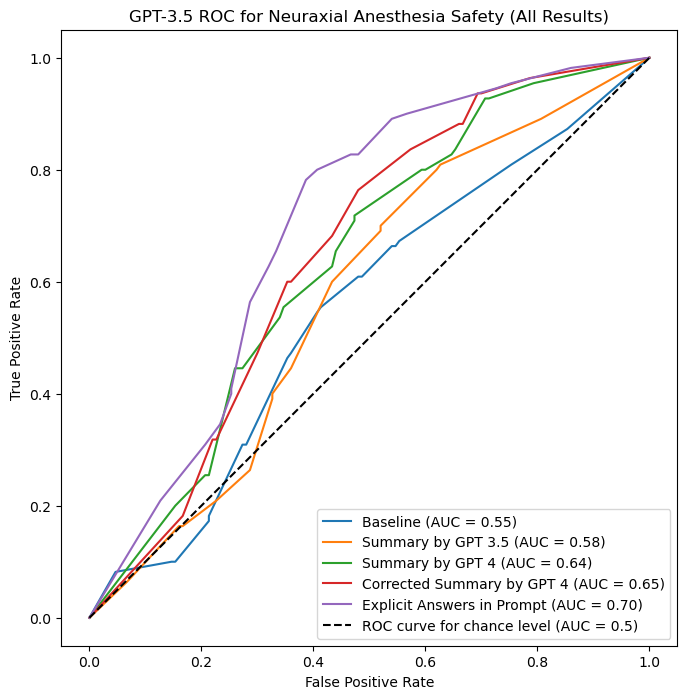

# DangerDangerGastonLabat
 Code to accompany "Danger, Danger, Gaston Labat! Does Zero-Shot Artificial Intelligence Correlate with Anticoagulation Guidelines Recommendations for Neuraxial Anesthesia?"

## Authors
Nathan C. Hurley, MD, PhD†; Rajnish K. Gupta, MD‡; Kristopher M. Schroeder, MD†; and Aaron S. Hess, MD, PhD†,§  
† Department of Anesthesiology, University of Wisconsin, Madison, WI  
‡ Department of Anesthesiology, Vanderbilt University Medical Center, Nashville, TN  
§ Department of Pathology and Laboratory Medicine, University of Wisconsin, Madison, WI

## Corresponding Author
Address correspondence to:  
Aaron S. Hess, MD, PhD, Department of Anesthesiology, University of Wisconsin, Madison, WI and Department of Pathology and Laboratory Medicine, University of Wisconsin, Madison, WI  
(e-mail: ahess5@wisc.edu).

## Abstract
### Introduction
Artificial Intelligence (AI) and Large Language Models (LLMs) have emerged as potentially disruptive technologies in healthcare. In this study, GPT-3.5, an accessible LLM, was assessed for its accuracy and reliability in performing guideline-based evaluation of neuraxial bleeding risk in patients on anticoagulation medication. The study also explored the impact of structured prompt guidance on the LLM’s performance.

### Methods
A dataset of 10 hypothetical patient stems and 26 anticoagulation profiles (260 unique combinations) was developed based on ASRA-PM guidelines. Five prompts were created for the LLM, ranging from minimal guidance to explicit instructions. The model's responses were compared to a "truth table" based on the guidelines. Performance metrics, including accuracy and AUROC, were used.

### Results
Baseline performance of GPT-3.5 was slightly above chance. With detailed prompts and explicit guidelines, performance improved significantly (AUC 0.70, 95%CI [0.64 – 0.77]). Performance varied among medication classes.

### Discussion
LLMs show potential for assisting in clinical decision-making but rely on accurate and relevant prompts. Integration of LLMs should consider safety and privacy concerns. Further research is needed to optimize LLM performance and address complex scenarios. The tested LLM demonstrates potential in assessing neuraxial bleeding risk but relies on precise prompts. LLM integration should be approached cautiously, considering limitations. Future research should focus on optimization and understanding LLM capabilities and limitations in healthcare.

## Repository Structure
- LICENSE
- analysis.ipynb
- prompt_stems.txt
- LLM Testing.ipynb
- med_stems.txt
- results/
  - 0_baseline.csv
  - 1_gpt3.csv
  - 2_gpt4.csv
  - 3_gpt4corr.csv
  - 4_explicit.csv
  - truth_table.csv
  - Figure.png
- README.md
- patient_stems.txt

## Instructions to Duplicate Work
To duplicate our work, `LLM Testing.ipynb` should be run 5 times, iterating through setting PROMPT_ID as 0-4. That will (re)generate the 5 csvs with those respective names in `results/`. Note that the user will need to obtain and specify their own OpenAI API key. Note that this code was originally run in April 2023, and results may differ due to changes from OpenAI since that time.

`analysis.ipynb` generates the figures used in the text. It compiles the 5 result csvs along with the truth_table (golden standard) for analysis.

For full dependencies, see the Jupyter Notebooks.

## License
This project is licensed under the GNU General Public License v3.0 (GPLv3). See the [LICENSE](./LICENSE) file for details.

